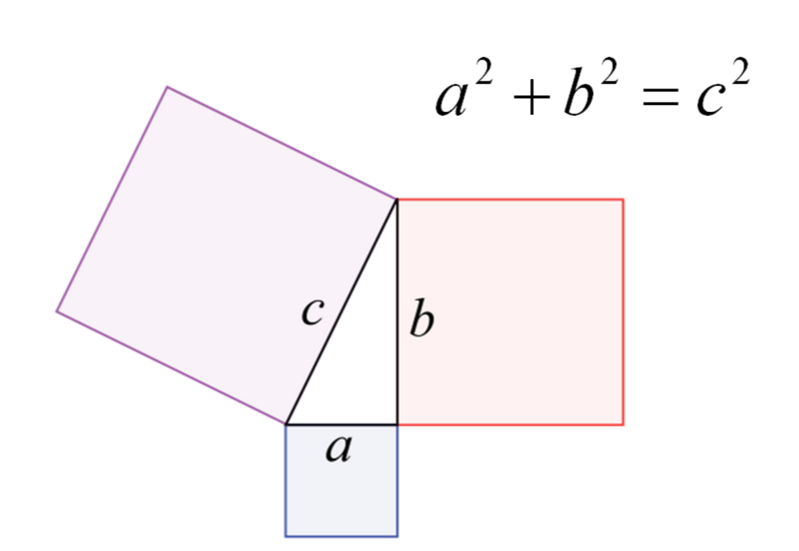
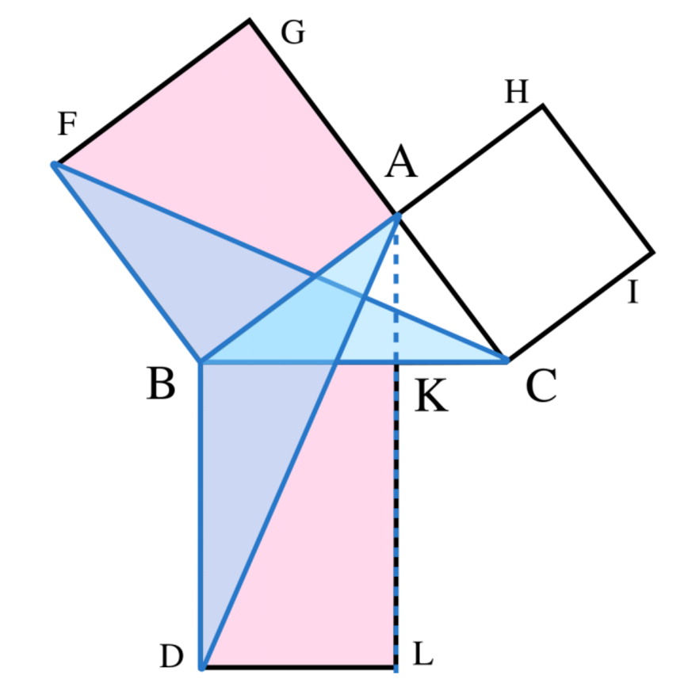
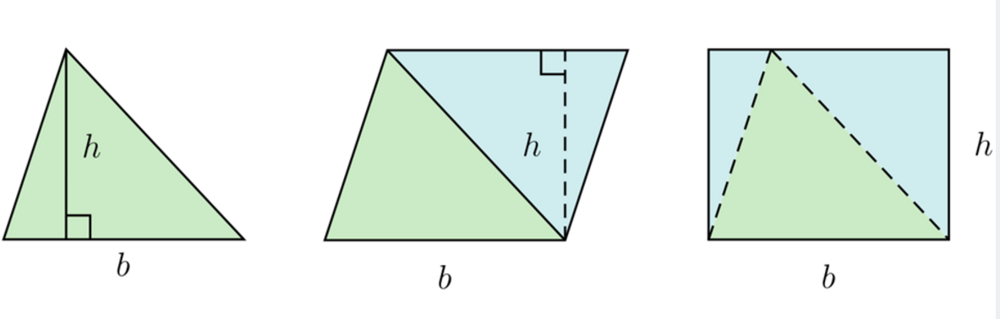

### 第五次课

#### 第五题：试答以下有关演绎推理形式逻辑体系的问题

##### 亚里斯多德的演绎推理形式逻辑体系的三大初始前提是什么？

公设、定义、假设。

公设是原理，没有它们就不可能推理，定义就是假定术语的意义，而假设是假定某种事物，对应于某术语。

    

##### 欧几里德原本第一卷的内容是什么？(必须用英文回答)

The whole Element is a collection of definitions, postulates(axioms), propositions(theorems and constructions), and mathematical proofs of the propositions.

Book1 deals with plane geometry, including 23 definitions, 5 postulates( including the parallel postulates ), 10 axioms, 5 common notions and 48 propostions( including basic propostions of geometry with the Pythagorean theorem as the Proposition 47).

几何基础，确立了23条定义、5个假设、5点共识、48个命题。确立了定义、共设和公理，包括一些关于全等形，平行线和直线型的定理。

##### 欧几里德原本第一卷命题47是什么？试给出欧几里德证明时所用图形。

Pythagorean Proposition based on axiom of plane geometry.

In right-angled triangles, the square on the side subtending the right-angle equal to the (sum of the) squares on the sides containing the right-angle：

